<!--
  OBADA — GitHub Profile README

  SVG assets:
  /assets/hero.svg
  /assets/divider.svg
  /assets/footer.svg

  Replace the placeholder SVG files with your animated versions.
-->

<p align="center">
  
</p>

<p align="center">
  <a href="YOUR_LINKEDIN_URL">
    
  </a>
  <a href="mailto:YOUR_EMAIL">
    
  </a>
  <a href="https://github.com/YOUR_USERNAME">
    
  </a>
</p>

<br>

## Who am I?

I'm an **AI-focused software developer based in the UAE**. I enjoy taking complicated problems and figuring out how software, AI, and automation can make them simpler.

My main interests are **AI engineering, agentic systems, LLMs, automation, and software architecture**.

I don't want to just use AI APIs. I want to understand the systems behind them and eventually be able to design and build the whole thing — from the underlying software to the intelligent layer.

<p align="center">
  
</p>

## Things I've Built

### AI Systems

I've built AI-powered systems that combine **LLMs, agents, automation, structured workflows, and human review** to solve problems that would otherwise require significant manual effort.

One of my larger projects is an **automated assessment generation system** designed for international educational programs.

I've also built **RAG-based applications**, connecting language models to external knowledge sources so they can work with information beyond their training data.

### Education Technology

I've worked on **large-scale digital assessment platforms** designed for students, combining software engineering with education technology and AI.

This is an area I particularly enjoy because it sits right between two things I'm interested in: **building useful technology and making learning better**.

### Automation

I've built workflows that connect **AI models, APIs, databases, and business processes**, turning complicated multi-step tasks into automated systems.

I'm especially interested in where automation ends and genuinely **agentic software** begins.

<p align="center">
  
</p>

## Experience

**Technical Pedagogy Developer**  
Abu Dhabi Department of Education and Knowledge

Working on AI, software, automation, and education technology.

I've had the opportunity to work on systems where an AI prototype isn't enough — they need to be reliable, maintainable, secure, and useful at scale.

Previously, I worked on AI and software projects involving **LLMs, RAG, education technology, automation, and full-stack development**.

<p align="center">
  
</p>

## Education

**University of the People**  
Computer Science

**42 Abu Dhabi**  
Software Engineering & Computer Science

I learn heavily through building things myself. Formal education gives me the foundations; projects and experimentation are where I tend to go much deeper.

<p align="center">
  
</p>

## Technologies

<p align="center">
  
</p>

<p align="center">
  
  
  
  
  
  
</p>

<p align="center">
  <sub>Python · C++ · C · Java · JavaScript · TypeScript · React · Vue · Node.js · Laravel · SQL · MongoDB · Linux</sub>
</p>

<p align="center">
  
</p>

## What I'm Exploring

I'm currently going deeper into **AI system architecture** — especially how models, agents, tools, memory, retrieval, and traditional software can work together to create useful systems.

```text
AI Engineering
     │
     ├── LLMs
     ├── Agents
     ├── RAG
     ├── Tool Use
     ├── Automation
     └── System Architecture

<!---
0bada1/0bada1 is a ✨ special ✨ repository because its `README.md` (this file) appears on your GitHub profile.
You can click the Preview link to take a look at your changes.
--->
